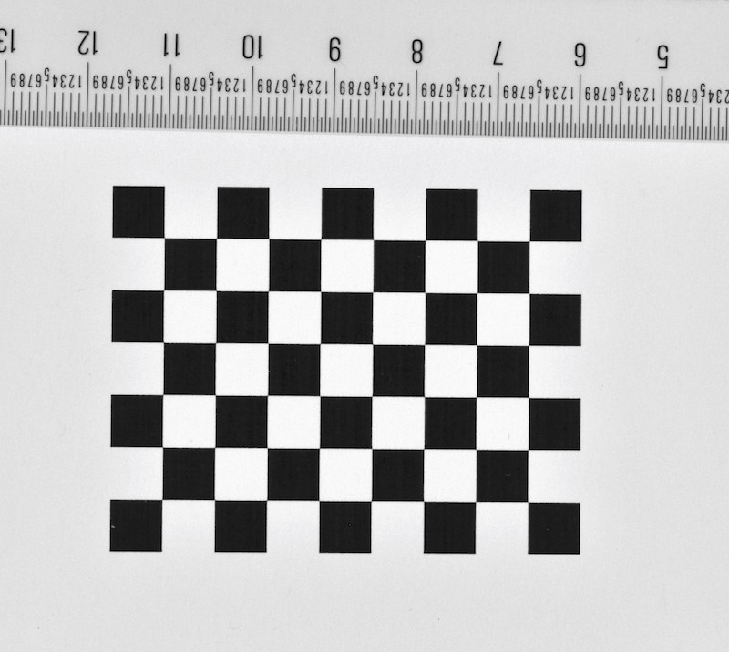
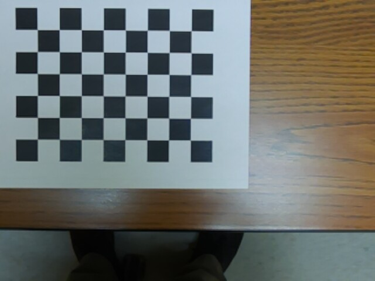
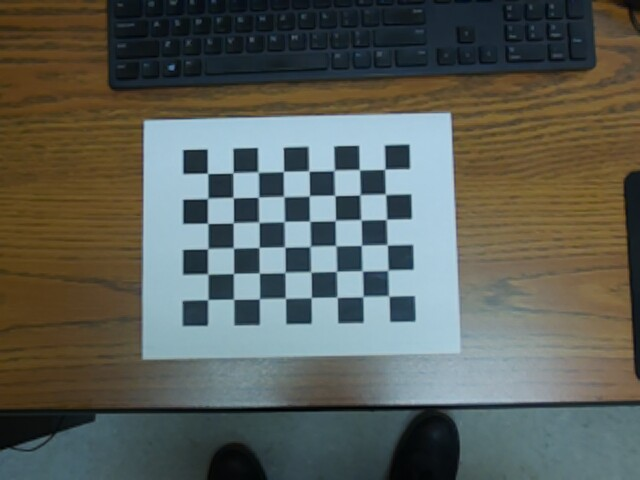
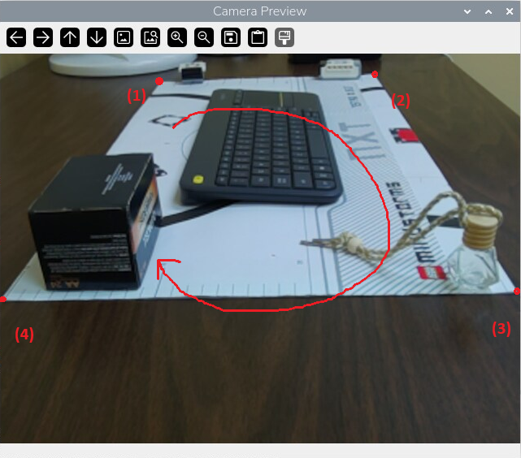
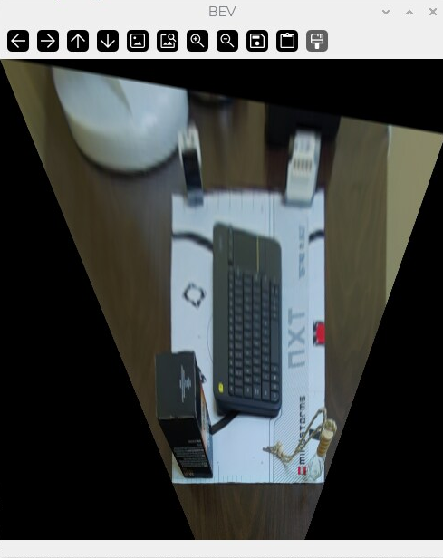
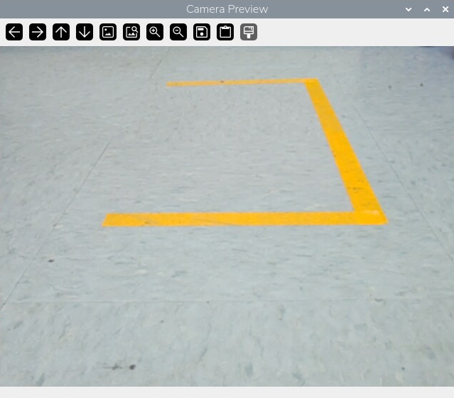
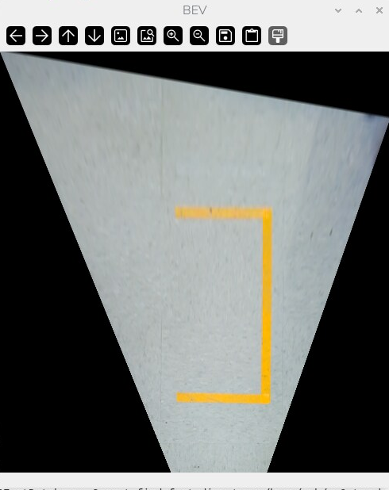
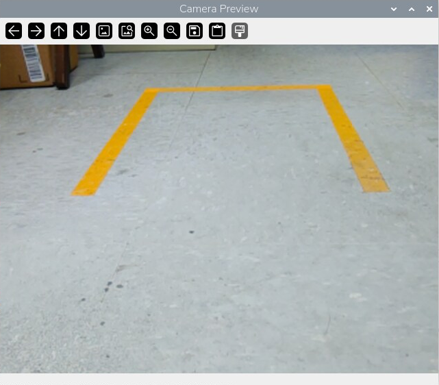
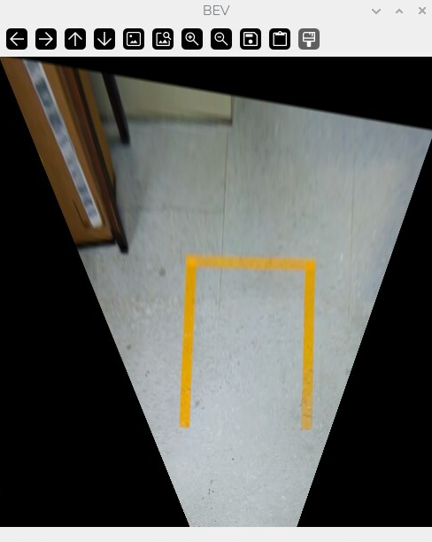

# CameraCalibration
Camera mount angle changes daily, but the lens itself doesn't — focal length and distortion coefficients are fixed properties of the camera/lens pair. So we will do two different calibrations:
- **Intrinsic calibration (once, ever):** standard OpenCV checkerboard calibration → `camera_matrix`, `dist_coeffs`. Save to disk, reuse forever. Undistort every frame with this before anything else.
- **Extrinsic calibration (daily, ~10 sec):** just the ground homography, using a known rectangle shape. This is the part that changes when the mount gets bumped.

## 1. Intrinsic Calibration
Computer vision programs work best when the len's distortion is lowest, especially in the corners of the view. 

Please use a standard checkerboard, and count the number of insider corners. For example, in the following checkerboard, it includes a 9 * 7 square pattern that contains 8 * 6 inner grid corners. 


| Board Dimension | Different Location | Different Distance |
| :---: | :---: | :---: |
|  |  |  |
| Count the grid of inner corners, and measure the length the square | Move the camera lens so that the checkerboard will show up at different locations in the view | Adjust the distance of the camera to get checkerboard with different sizes. |

- The dimension of the checkerboard is an essential piece of information. Can can define it as `CHECKERBOARD = (8, 6)`.
- Use a precision ruler to measure the exact square size in millimeters (e.g., 
22.75 mm). We can define this as `SQUARE_SIZE_MM = 22.75`.
- Place the printed checkerboard paper on a flat surface. Any warps or bends in the board will ruin the calibration.
- Move the cameras to capture at least 20 images from different angles and distances, with the checkerboard at different locations in the camera's view. [Here is a program](src/capture.py) to catpure 20 images. To run these Python programs, you need to *first activate the prepared virtual environment* where libraries like OpenCV and picamera2 have been installed, by a command like `source ~/ev3_env/bin/activate`. Please change the name of the venv based on you case (the corresponding folder should be under ~/Documents/, the name of this venv should be similar as ev3_env).  You can save the images into a folder, e.g., `'/home/rob/Documents/cam/cv/calibration/*.jpg'`. You may have already noticed the distortion in the camera's view: straight lines will be bended. 
- The [provideded program](src/checkerboard.py) can be used to finish the intrinsic calibration with the images and parameters above. Please modify the parameters and path of the images accordingly. 
- This calibration program will output a file `camera_calib.npz`, 

With the calibration file ready, you can use it in the following to apply calibration to every video frame via `cv2.undistort()` utility:
```python
import cv2
import numpy as np
from picamera2 import Picamera2
import time

FRAME_WIDTH = 640
FRAME_HEIGHT = 480

calibration_data = np.load("/home/rob/Documents/cam/cv/camera_calib.npz")
try:
    camera = Picamera2()
    config = camera.create_preview_configuration(
        main={"size": (FRAME_WIDTH, FRAME_HEIGHT), "format": "RGB888"}
    )
    camera.configure(config)
    camera.start()
    time.sleep(2)  # Camera warm-up
    while True:
        frame = camera.capture_array()
        frame = cv2.undistort(frame, calibration_data["matrix"], calibration_data   ["dist"])
        cv2.imshow("Camera Preview", frame)

        key = cv2.waitKey(1) & 0xFF
        if key == ord('q'):
            break
finally:
    camera.stop()
    cv2.destroyAllWindows()
```

## 2. Extrinsic Calibration

If the camera's len is fixed without changing the angle, we also only need to do this extrinsic calibration once. But our camera's angle would be changed almost every time when we get it out of the box. So we need to do the following calibration everyday. The idea here is to support the accurate mapping between real world and camera view, e.g., we will be able to estimate the real location or real length of the object in the real world based on the camera's view. 

For this, we need a rectangle shape mat or paper. Before the calibration, we need measure its dimension and horizontal distance to the camera (e.g., `REAL_MAT_W_CM = 33.3`, `REAL_MAT_H_CM = 63.0`, and `MAT_DIST_FROM_CAMEMRA_CM = 30.0`). 


- Place the calibration mat on a flat surface. Any warps or bends in the board will influence the calibration. Please try to make it as flat as possible, especially when this mat is big: to achieve this, you can put some paper weight on top -- only the positions of four corners of this mat would matter. 
- The [provideded program src/calibrate_bev.py](src/calibrate_bev.py) can be used to finish the extrinsic calibration . Please modify the parameters accordingly. Similar to the program for intrinsic calibration, run this calibrate_bev.py program also under the Python virtual environment. This program will show a preview of the camera's view where the calibration mat is captured, and we need to use the mouse to click on different corners of the calibration mat in the order of (1) top left -> (2) top right -> (3) bottom right -> (4) bottom left. And then click 'q' on the keyboard to end this program. 
- This calibration program will output a file `camera_calib.json`, 

The calibration process can be illustrated as:


With the calibration file, we can convert the original view into bird's eye view for more convenient geometry calculation, via `cv2.warpPerspective()` utility:
```python
import json

with open("camera_calib.json", "r") as f:
        calib = json.load(f)

M = np.array(calib["M"], dtype=np.float32)
BEV_W = calib["bev_width"]
BEV_H = calib["bev_height"]

try:
    # copy the preview program here

    frame = cv2.undistort(frame, calibration_data["matrix"], calibration_data["dist"])
    bev_frame = cv2.warpPerspective(frame, M, (BEV_W, BEV_H))
    cv2.imshow("Camera Preview", frame)
    cv2.imshow("BEV", bev_frame)
finally:
    # copy the preview program here
```

Once this is done, the geometry relations in the video frames of bird's eye view (BEV) would be aligned with the real world, so it's would be very intruitive to further process the video frames. Clear evidences could include:
- Parallel lines are recovered: in the original view, parallel lines will converge. 
- Lines with the same length will appear the same: in the original view, the same line appears longer when it's closer to the camera. 

| Original view of calibration mat | Bird's eye view of the calibration mat |
| :---: | :---: |
|  |  | 

| Original view of parallel parking bay | Bird's eye view of the parallel parking bay |
| :---: | :---: |
|  |  | 

| Original view of forward parking bay | Bird's eye view of the forward parking bay |
| :---: | :---: |
|  |  | 

Please note: the angle of view of our camera is about 45 degree, and this is aligned with the result in the BEV. The top right corner here is also black, and this might be because the camera is not placed perfectly horizontal or the camera's sensor covers uneven area in the vision. 